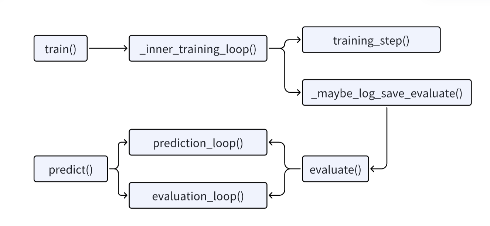

# Train()
Input dataset should be tokenized before using.  
注意Trainer拿到的训练数据是 数值类型，而不是文本类型。所以在定义trainer之前，得先将文本 tokenized。 
这个函数是训练模型的接口，里面也会进行模型评估。  
其调用了 _inner_training_loop() 函数。

总的来说，数据流是：
输入数据在 get_train_dataloader() 中被封装成 torch 的 dataloader。并且删除了模型forward()参数表和自定义的label之外的列。
数据被输入给model，模型计算并且返回损失值。  
记住损失值是在模型内部计算的。  
然后调用了用户自定义的 metric函数。

## _inner_training_loop()
_inner_training_loop() is the main loop of training.   
training_step() is a single training step.  
During training, _maybe_log_save_evaluate() will be called to evaluate the model.  
这个函数是实质上进行训练的函数。  
这个函数实现的训练的过程，并且调用了评估的函数 _maybe_log_save_evaluate()。
单次训练被封装到 training_step()中。  
数据则是通过 get_train_dataloader() 进行封装的。  

## training_step()
Perform a training step on a batch of inputs.  
Return: `torch.Tensor`: The tensor with training loss on this batch.
这个函数执行一次训练。并且返回在这个batch上的损失值。  
_prepare_inputs() 函数检查输入的类型，以及输入是否在对应的设备上。  

smp_forward_backward() 函数：
```python
def smp_forward_backward(model, inputs, gradient_accumulation_steps=1):
        outputs = model(**inputs)
        loss = outputs["loss"] if isinstance(outputs, dict) else outputs[0]
        loss /= gradient_accumulation_steps
        model.backward(loss)
        return loss
```
这个函数执行一次 feed forward 和 一次 backward propagation。  
并且注意到，损失值竟然是模型自己返回的。  

这里面的 compute_loss() 函数也可以计算 feed forward，并且返回 损失值。  
但是重要的是，这里它写着：“How the loss is computed by Trainer. By default, all models return the loss in the first element.”也就是，按照规定，模型的返回值的第一个参数就应该是损失值。也就是说，损失函数和损失值是用户自己定义的。  


## get_train_dataloader()
Returns the training [`~torch.utils.data.DataLoader`].
这个函数本质上是在结合 data_collator 和 dataset，构成一个 DataLoader，从而能够实现动态batch 和padding。  
同时这个函数里面有两个叫做 _remove_unused_columns() 和 _get_collator_with_removed_columns() 的  
函数。这两个函数删掉了部分columns。  

## _remove_unused_columns()
This function will delete columns from input dataset. Only columns defined in model.forward() and in Trainer.label_names will be preserved.   
根据模型 forward() 函数的参数表，删除无用的 clomuns。  
除此之外，["label", "label_ids"] + self.label_names 等列也会被保留下来。  

而这里的 label_names 是通过 TrainingArguments 定义的。

也就是所，模型接受什么参数，还是用户自己定义的。这点很符合常识。  
并且这个函数里面集成了 sampler，这样输入的数据就不必是打乱的了。  

# _maybe_log_save_evaluate()
_maybe_log_save_evaluate() will be called to evaluate the model.  
会调用 evaluate() 函数进行模型评估。  
总的来说，在evaluation阶段，模型会输出 loss 和 logits。 然后能从输入中直接获得 labels。  
其中 loss 和 logits 来自模型的输出。 loss 会作为返回值被返回。  
logits 和 labels 会参与后续的 metrics 计算，并且是直接输入给metric的那种：
“metrics = self.compute_metrics(EvalPrediction(predictions=all_preds, label_ids=all_labels))”
但是这里我不清楚的是，这里的 logits 和 labels 都经过了一些处理。我不清楚他们被做了什么处理。  
所以在实现自己的metrics的时候存在困难。  
所以其实还是不能解决我遇到的困难。也回答不了我的问题。我还是不知道该怎么根据数据集选择metrics，还是不知道怎么自定义，还是不知道怎么给自己的数据定义metrics。  


## evaluate()
Run evaluation and returns metrics.

The calling script will be responsible for providing a method to compute metrics, as they are task-dependent
(pass it to the init `compute_metrics` argument).

这个函数是实质上进行评估的函数。  
这个函数会调用 prediction_loop 或者 evaluation_loop 去评估模型，并且计算 metrics的值。  
我们输入的 metrics 会在 evaluation_loop 中执行。  

## evaluation_loop()
Prediction/evaluation loop, shared by `Trainer.evaluate()` and `Trainer.predict()`.
Works both with or without labels.
这个函数执行了 evaluation的loop，每一次的evaluation 则是由 prediction_step 完成：  
loss, logits, labels = self.prediction_step(model, inputs, prediction_loss_only, ignore_keys=ignore_keys)

执行完所有的prediction 之后，他会执行 metrics计算。 
计算时会使用到 all_preds 和 all_labels。  
其中 all_preds 包含的是 prediction_step （模型）输出的 logits， 当然是被处理过后的 logits。处理操作包括padding（对齐）、类型转换、加载到CPU等等。  
all_labels 和 all_preds 类似，包含的是 prediction_step （模型）输出的labels， 也有一些类似的处理。  


## prediction_step()
Perform an prediction step on `model` using `inputs`.  

Inputs: The dictionary will be unpacked before being fed to the model. Most models expect the targets under the argument `labels`. Check your model's documentation for all accepted arguments.

这个函数的三个返回值 loss、logits 和 labels中，前两者是模型的输出。 但labels是直接从inputs中提取出来的。  
这个函数调用了 smp_forward_only() 函数，来进行 prediction。  

而 smp_forward_only() 函数其实就是执行了模型的预测：“model(**inputs)”


